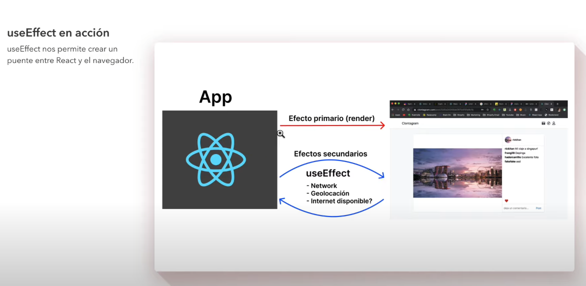

# React

[Instalaciones - npx or yarn (typescript)](https://create-react-app.dev/docs/installing-a-dependency)

```js
  // Cuando hacer console de un elemento de react, veremos un nodo del VirtualDOM
  const h1 = <h1>Hello</h1>
  console.log(h1) // esto un objeto que representa un nodo del Virtual DOM
  // todo nodo del virtual dom tiene una propiedad children que son los nodos hijos que tiene el node original
  // estos hijos puedes ser otras etiquetas o string simples
  <Component>
    <Child />
  </Component>
```

## Estado

Es como se encuentra la informacion del componente en un punto determinado del tiempo
La mutacion de las propiedades del componente

## Eventos en REACT

[https://es.reactjs.org/docs/events.html](https://es.reactjs.org/docs/events.html)

## Pruebas unitarias

Unitaria viene de pruebas enfocadas a funcionalidades pequeñas,
pequeñas piezas de la aplicacion.

Para una prueba necesitamos saber el inicio y fin de un proceso.
a este camino se le conoce como ruta critica.

### Introduccion a las pruebas e integracion

1. ¿Qué son?
    - Pruebas unitarias : Pruebas enfocadas a pequeñas funcionalidades
      - Ejm: Llanta (gire correctamente,resistencia, y varias otros pruebas)
    - Pruebas de integración : Enfocadas en cómo reaccionan varias piezas en conjunto
      - Ejm: Tomar las llamas y probar en conjunto con la carroceria
2. ¿Para qué sirven?
3. Características
   1. Faciles de escribir
   2. Faciles de leer
   3. Confiables
   4. Rapídas
   5. Principalmente unitarias *(importante)*
4. Mitos
   1. Hacen que mi aplicacion no tenga errores - (Error)
   2. Las pruebas no pueden fallar (Error)
   3. Hacen más lenta mi aplicacion (Error - no es parte del bundle)
5. Lineamientos

### Patron AAA

- Arrange (Arreglar)
  - Preparamos el estado inicial:Paso en el que establecemos el paso inicial.
    Usualmente se conoce como el sujero a probar
    - Inicializamos variables
    - Importaciones necesarias
    - Preparamos el ambiente
- Act  (Actuar)
  - Aplicamos acciones o estimulos al sujeto de prueba
    - Llamamos métodos
    - simulamos clicks
    - Realizar acciones obre el primer A (Arrange)
- Assert (Afirmar)
  - Observar el comportamiento resultante
    - Verificar si los resultados son los esperados
    - Ej: Que algo cambie, algo incremente o bien que nada suceda

### Test Suit

Es un conjunto de pruebas, cada archivo .test.js sera un test suit

````sh
  # por defecto react utiliza jest
  npm run test #por defecto ejecutara todos los archivos que tengas .test.js

  # al momento de testear los componentes me sale error sobre react 18 (render)
  # actualiza todo que diga testing en el pockage.json - la extension te dira que dependencias estan desactualizadas
  # utilizaremos enzime que funciona para react 17 y 18
  # https://github.com/wojtekmaj/enzyme-adapter-react-17 
  # Es un adaptador que nos ayuudará  a hacer pruebas a nuestros componentes
  npm install --save-dev @wojtekmaj/enzyme-adapter-react-17
  # o
  yarn add enzyme
  yarn add enzyme-to-json
  yarn add --dev @wojtekmaj/enzyme-adapter-react-17
````

### Custom Hooks

- No es mas que una forma que extraer logica de un componente para poder reutilizarla en otro componente

### HOOKS

- [mis Pequeños ejemplos de useEffect y hooks](https://stackblitz.com/edit/vitejs-vite-ptayle?file=src%2F04CoordinatesHook.jsx&terminal=dev)
- [useEffect](https://stackblitz.com/edit/vitejs-vite-pgwkfp?file=src%2F002useEffect.jsx&terminal=dev)

#### useState

#### useEffect

¿Que sabe hacer reat?
React lo que sabe hacer es dibujar en el DOM(render)
El efecto primario(resultado de ejecutar el codigo de react) de React es mostrar HTML en el DOM

- **Con esto tenemos un problema**
  Una aplicacion web hace mucho más que solo mostrar HTML
- llamadas HTTP
- interaccion con APIs del navegador
- y mas

¿Como hacemos que react haga mas que solo mostrar HTML?

Con **`useEffect`**, que React haga mas cosas que solo renderizar

Se llama useEffect porque estamos haciendo un efecto secundario. Queremos que hago algo distinto de mostrar HTML
Los efectos secundarios son efectos que React no sabe hacer nativamente



#### useRef

Mantiene una referencia mutable

#### useFetch

#### useLayoutEffect

Funciona igual que el `useEffect`, pero el useLayoutEffect es sincrono mientras que el `useEffect` es asincrono.

- Flujo de `useEffect`
  - El estado del componente cambia
  - El componente de vuelve a renderizar
  - El componente es mostrado en pantalla
  - se ejecuta el callback del `useEffect` dependendiendo de la lista de dependencias
- flujo de `useLayoutEffect`
  - El estado del componente cambia
  - El componente de vuelve a renderizar
  - se ejecuta el callback del `useLayoutEffect` dependendiendo de la lista de dependencias.
    Se ejecutará despues de que toda la manipulacion del DOM se haya hecho.Bloqueara todo ya que es sincrono
  - El componente es mostrado en pantalla

Lo que entiendo:
cuando mensiono de renderizar es en el Virtual DOM.
y el useLayoutEffect puede manipular esto antes de que se muestre en el DOM real
y sea mostrado en la pantalla.

Se debe de usar `useLayoutEffect` cuando queremos manipular el DOM antes de mostrarse en la pantalla.(SINCRONO)

- https://platzi.com/blog/useeffect-uselayouteffect/
- https://matiashernandez.dev/blog/post/cuando-usar-el-hook-uselayouteffect

#### Memo

React.memo se utiliza para memorizar un componente y si sus props cambian
se vuelve a renderiza, pero si no cambian no renderizará otra ves ya que ya almaceno el componente.

Y que pasa si unos de sus props es una funcion cada ves que el componente wrapper o conocido como ansestro o padre cambia de estado y este tiene la funcion que pasara al hijo, la funcion no será la misma ya que será otra referencia
en el caso de los valres primitivos no hay problemas ya que se verificará por el valor.
Ejem:

```jsx
  const Child = React.memo(({ fn }) => {
    return <button onClick={ ()=> fn() } >+1</button>
  })

  const Wrapper = () => {
    const [state,setState] = useState(1)
    
    // Cada ves que renderiza este componente esta funcion se volverá a crear por lo cual seria otra
    // referencia y por ende no funcionaria el React.memo
    const increment = () => {
      setState(state + 1)
    }
    
    return <div>
      <Child fn={increment} /> 
    </div>
  }

```

#### useMemo

Nos sirve para momorizar valores, normalemente lo que retorna una funcion
Teniendo igualmente una lista de dependencias

#### useCallback

Aqui podemos momorizar la funcion, la referencia. En ente caso podemos arreglar el doble renderizado
del ejemplo React.memo

```jsx
  const Child = React.memo(({ fn }) => {
    return <button onClick={ ()=> fn() } >+1</button>
  })

  const Wrapper = () => {
    const [state,setState] = useState(1)
    const increment = useCallback(() => {
      setState(c => c + 1)
    },[setState])
    return <div>
      <Child fn={increment} /> 
    </div>
  }
```

Otro caso es cuando tenemos un useEffect y la dependecia es una funcion, tenemos que hacer que esa funcion utilice un useCallback

```jsx
  const [state,setState] = useState(1)
  const increment = useCallback(() => {
    setState(c => c + 1)
  },[setState])
  useEffect(()=>{
    // algo
  },[increment])
```

#### useReducer

A diferencia del `useState` el useReduce se utiliza cuando muchas acciones pueden
modificar el state de la aplicación

**¿Que es Reducer?**

- Es una función común y corriente (no puede ser asincrona)

  ```jsx
  const todoReduce = () => {}
  ```

- Debe de ser una funcion pura
  - No debe de tener efector secundarios
  - No debe de tener tareas asincronas
  - Debe de retornar siempre un nuevo estado
  - No debe de llamar el localStorage o el sessionStorage dentro del reducer
  - para modificar el state no debe de requerir mas que una acción que pueda tener un argumento o no
- Debe de retorna un nuevo estado
- Usualmente sólo recibe dos argumentos
  - El valor inicial (initialState)
  - La accion a ejecutar

El objetivo de todo esto es tener controlado en un solo lugar todas las acciones que modifican el state

```jsx
  const initialTodos = [{
    id:"142as4d4asd",
    todo : "Comprar pan".
    done : false
  }]

  const todoReducer = (state = initialTodos,action) => {
    return state
  }
```

Cuando el state es muy complejo

```jsx
 {
   foo: {
     faa: {
       test: [],
       testB: ''
     }
   },
   fee: [],
   fii: {
     testC: [],
     testD: {}
   }
 }
```

https://gitlab.com/ThomRoman/learning-react/-/tree/main/03-hooks/hook-app/src/components/09-useReducer

**Funcionamiento Reducer**
  
- Se carga el state
- El componente se renderiza y muestra el state
- Si el usuario necesita hacer algo con el state,
  El componente no se comunica directamente con el state, sino mediante una accion
- Esta accion se enviará al reducer(que tiene un mapa de las acciones) y cuando termine
  la accion este recien modificará el state, el cual al mutar notificará al vista y se 
  rendizará

[Mi ejemplo sencillo de useReducer](https://stackblitz.com/edit/vitejs-vite-wbuewy?file=src%2FApp.jsx&terminal=dev)

Conclusion:

- No usar useReducer si el estado es pequeño o si no hay muchas acciones que van a manipular el estado
- Usar useReducer cuando el cuerpo del estado es muy complejo o hay muchas acciones que van a modificar
  el estado y ademas estas acciones se tienen que pasar entre componentes
- centralizar la logica que cambia el estado de distintas formas

#### Context API

- createContext
- Provider
- Consumer
- useContext

Ejemplos que tengo y explicacion:

- [ejemplo mio](https://gitlab.com/ThomRoman/learning-react/-/tree/main/03-hooks/hook-app/src/components/10-useContext-Yo)
- [ejemplo pero dentro de este repo hay mas](https://stackblitz.com/edit/vitejs-vite-kec6wa?file=src%2FApp.jsx)
- [Ejemplos externos I](https://kentcdodds.com/blog/how-to-use-react-context-effectively)
- [Ejemplos externos II](https://kentcdodds.com/blog/application-state-management-with-react)
- [Ejemplos externos III](https://www.freecodecamp.org/news/react-context-for-beginners/)
- [Ejemplos externos IV](https://dmitripavlutin.com/react-context-and-usecontext/)

#### PORTALES

No sirve para pasar contenido HTML a otros nodos del DOM
Nos ayuda en componentes interactivos.Inyectar contenido HTML dinamico a un node diferente del root

```jsx
  import ReactDOM from 'react-dom/client'
  ReactDOM.createPortal(child, container)


  // primer ejemplo de portal

  const Modal = ({ children,handleCloseModal }) => {

    useEffect(()=>{
      document.body.classList.addd('overflow-y-hidden');
      return () => {
        document.body.classList.remove('overflow-y-hidden');
      }
    },[])

    return ReactDOM.createPortal((
      <div className="modal">
        <div className="modal__content">
          // dentro de ese hanldeCloseModal reseatermos el contenido que se mostrará,
          // si no muestra ningun contenido simplemente que cierre el modal
          <button className="modal__action" onClick={handleCloseModal}>X</button>
          {children}
        </div>
      </div>
    ),document.getElementById('modal-container'))
    // verificar en el index.html que exista ese elemento como hermano del #root
  }

  // en otro componente

  const [previewMovie,setPreviewMovie] = useState()

  <MoviesGrid
    movies={movies}
    loading={loading}
    error={error}
    setPreviewMovie={setPreviewMovie}
  />
  {previewMovie && (
    <Modal closeModal={() => setPreviewMovie()}>
      <MoviePreview {...previewMovie} />
    </Modal>
  )}

  // dentro de MoviesGrid
  const MoviesGrid = ({ movies, loading, error, setPreviewMovie }) => {
    if (loading) return <p>Cargando...</p>;

    if (error) return <p>{error}</p>;

    return (
      <div className='flex flex-wrap'>
        {movies &&
          movies.map(movie => (
            <MovieCard
              key={movie.id}
              title={movie.title}
              image={movie.image}
              year={movie.year}
              rating={movie.rating}
              onClick={() => setPreviewMovie(movie)}
            />
          ))}
      </div>
    );
  };

  // Componente Card
  const MovieCard = ({ title, image, year, rating, onClick }) => (
    <div className='w-1/5 p-4' onClick={onClick}>
      <div
        style={{
          backgroundImage: `url(${image})`
        }}
        className='relative aspect-2/3 bg-cover bg-gray cursor-pointer hover:scale-105 transition-transform'
      >
        <h3 className='absolute bottom-0 w-full bg-bg-700 p-2'>{title}</h3>
        <span className='absolute top-0 left-0 py-1 px-2 bg-primary'>
          {rating || '-'}
        </span>
        <span className='absolute top-0 right-0 py-1 px-2 bg-bg-700'>{year}</span>
      </div>
    </div>
  );


  // segundo ejemplo de portales
  // https://stackblitz.com/edit/vitejs-vite-9crkba?file=index.html&terminal=dev

  // tercer ejemplo de portales
  // https://stackblitz.com/edit/vitejs-vite-kadgz7?file=src%2FApp.css,src%2FApp.tsx,index.html&terminal=dev
```

#### Hook form

https://github.com/infodp/react-hook-forms/blob/main/src/components/FormValidation.js
https://codesandbox.io/s/holy-meadow-f8usrb?file=/src/components/01FormBasic.js

Ejemplo de un hook para formulacion ya creado


#### Enzime muerto en react 18

https://testing-library.com/docs/react-testing-library/example-intro
https://dev.to/wojtekmaj/enzyme-is-dead-now-what-ekl

#### Test react Vite

https://www.linkedin.com/pulse/setting-up-rtl-vite-react-project-william-ku/
https://blog.logrocket.com/testing-vite-minimal-config-using-vitest/
https://www.pixelmatters.com/blog/how-to-set-up-a-front-end-project-with-vite-react-and-typescript


#### Componentes controlados y no controlados

```jsx
  // componentes no controlados

  // react no es capaz de controlar el valor del formulario por defecto el valor que esta escrito en ele input
  // simplemente es capaz de reaccionar a un evento y poder recoger ese valor
  // podemos leer el valor que tiene ese input pero no podemos modificarlo

  // Es decir no podemos acceder a ese elemento en un momento determinado
  // no podemos leerlo exactamente cuando queremos
  // y tendremos que esperar a que suceda el evento onSubmit

  // las etiquetas html pasan a ser componentes como tal en jsx
  const [search,setSearch] = React.useState("")
  <form onSubmit{(event)=>{
    event.preventDefault();
    setSearch(event.target.search.value)
  }} >
    <input type="text" name="search" autoComplete="off" />
    <button type="submit">Search</button>
  </form>

  // componentes controlados
  // es mediate un estado
  // se dice que un componente es controlado cuando el estado lo maneja React
  // el valor del input es controlado directamente por react
  const [search,setSearch] = React.useState("")
  <form>
    <input type="text" name="search" value={search} autoComplete="off" onChange={(event)=>setSearch(event.target.value)} />
    <button type="submit">Search</button>
  </form>

  // recordar que esta la propiedad defaultValue para los inputs en react
  // para los checkbox defaultChecked

  // en jsx la etiqueta textarea tiene un atributo value cosa q en html no existe
  // y tambien tiene un defaultValue


  // Conclusion

  // componentes controlados : cuando manejamos los cambios de los componentes atraves de los estados, 
  // cuando delegamos los cambios de un elemento a React
  // useState

  // componentes no controlados : las acciones de los elementos no dependen de los estados de react, delegamos ese control al dom
  // cuando delegamos los cambios de un elemento al DOM
  // (ref)
  // (o mediante eventos)

  // thom
  // no uses setState y luego state en el mismo lugar
  // setName("asdasd")
  // console.log(name) // ""
  // esto se explica que cuando se utiliza el setName no implica que la variable name se cambie en este renderizado
  // dentro de este ambito

  // verificar el setName y el name serian dos tareas diferentes,v erificar cual es la importante y cual es la necesario 

  // https://www.youtube.com/watch?v=cBSn1nIRZq4&t=685s&ab_channel=Desarrollo%C3%9Atil
```

```html
  form avanzado
  https://stackblitz.com/edit/react-form-with-hooks-plelz1?file=src%2Fcomponents%2FloginForm%2Fhooks%2FuseLoginFormValidator.js,src%2Fcomponents%2FloginForm%2Fvalidators.js,src%2Fcomponents%2FloginForm%2FLoginForm.jsx,src%2Fcomponents%2FloginForm%2FLoginForm.module.css

  componentes controlados y no controlados
  https://www.escuelafrontend.com/articulos/las-diferencias-entre-componentes-controlados-y-no-controlados-en-react

  recursos para formulario

  <!-- https://formik.org/docs/overview -->
  <!-- https://www.npmjs.com/package/yup -->
  <!-- https://react-bootstrap.github.io/ -->
  <!-- https://tailwindcss.com/docs/installation -->
  <!-- https://github.com/falconmasters/validacion-formularios-react/blob/master/src/App.js -->
  <!-- https://github.com/falconmasters/formularios-react-formik -->

```

## Referencias

- [Mi propia documentacion](https://gitlab.com/ThomRoman/learning-react/-/tree/main/)
- [Estructura de proyecto por hackernoon](https://hackernoon.com/structuring-projects-and-naming-components-in-react-1261b6e18d76)
- [Estructura de proyecto por react](https://es.reactjs.org/docs/faq-structure.html)
- https://acesmndr.medium.com/testing-react-functional-components-with-hooks-using-enzyme-f732124d320a
- https://javascript.plainenglish.io/when-and-when-not-to-use-react-memo-e050d3cb1ffc
- [Otro patita tambien hizo el curso](https://github.com/anbreaker/cursoReactFH)