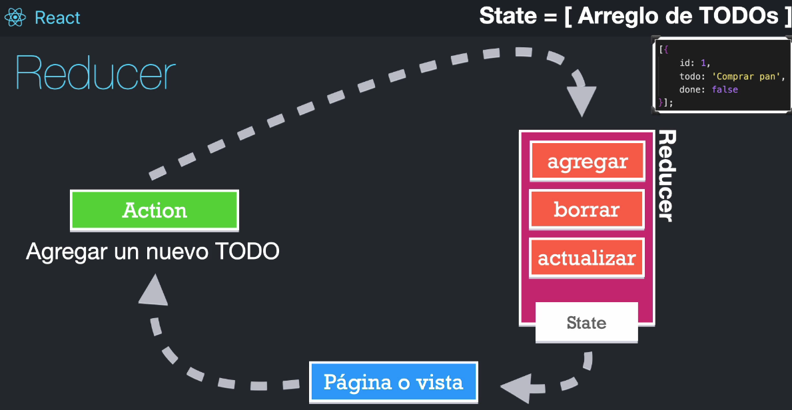
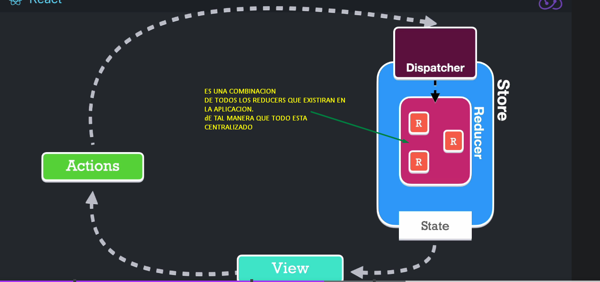
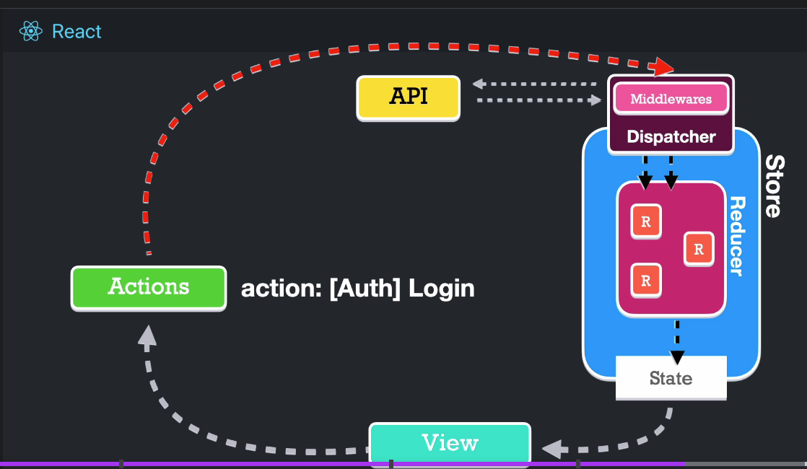
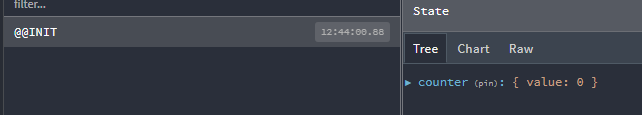

# Segunda parte

## Redux

Es un contenedor predecible del estado de nuesta aplicacion, es decir
que redux es una forma de controlar donde se encuentra la informacion
de nuestra aplicacion en todo momento, y tambien ayuda que la modificacion
de la informacion sea siempre en una sola via con el  objetivo de predecir
cambios accidentales en la misma.

Redux no es propio de react, existe tanto en Angular, vue etc
Es una forma de mantener el estado de la aplicacion

- Store en Redux : Fuente unica de la verdad
  Aqui es donde se encuentra la informacion que mis componentes consumirán

Reducer es una funcion pura que maneja el estado.

En este caso se utiliza reducer, donde la funcion reducer es la cual provee el state

Es una biblioteca y s un conjunto de patrones que nos indica como tratar el estado en nuestra aplicacion,
se basa en el patron flux



Utilizando Redux, donde el store es donde provee el store



El reducer mayor contiene todo los reducer pequeños.
cuando el dispatcher tiene la informacion con la accion y dice que reducer tiene
que hacer esta accion. Ese reducer pequeño tiene una logica (hace lo que tiene que
hace nosotros los programamos) y luego genera un nuevo state y este nuevo state
es quien notifica a la vista.

Todo ese proceso es sincrono.

Pero cuando tipo de la accion a realizar sea algo asincrono, se utilizará un middleware en el dispatcher.
Este middleware recibirá esta tarea asincrona, ejecutará la accion,
llamará al API traera los datos, esperará la respuesta. Y cuando tiene la
respuesta de la API, comunicará la middleware que este asu ves
comunicará al dispatcher y este asignará al accion al reducer que le corresponde.



Cualquier componente que necesita informacion ira al store para obtenerlo.

El dispatcher verificará si al tarea es asincrona o sincrona.

### Terminologia

- Redux: es el patron, el cual se basa en crear nuevos estados basado en reducers
  estos reducers son los que crean nuevos estados.
- React Redux : Era la forma tradicional de usar redux en React.
  Ya viene con un boilerplaite complejo, que me provee varias cosas.
  Nos ofrece varios componentes.
  El codigo se vuelve un poco complejo.
- Redux Toolkit (RTK) : Para implementar el patron redux sea mas sencillo.
  - RTK Query(paracedido al [React Query](https://react-query.tanstack.com/) o [useSWR](https://swr.vercel.app/))

```sh
  # https://redux-toolkit.js.org/tutorials/quick-start#install-redux-toolkit-and-react-redux
  # para instalat y tranajar con Redux-Toolkit
  npm i react-redux @reactjs/toolkit
```

createSlice, es un metodo que nos ayuda a crear un slice del
redux-store, la cual contiene el reducer y acciones en un solo archivo.

Un slice en redux es una coleccion de logica de reducers y acciones para una sola funcion
en la app



El @INIT es una accion especial, la cual indica que es el punto de inicialización del store.

Para automatizar un codigo es mejor crear un snippet en VScode

```text
  CTRL + SHIFT + p luego buscar Configure User Snippets, luego seleccionamos para el lenguaje js
  y en el cuerpo pega el codigo, nombre redux-slice
```

<https://gist.github.com/Klerith/060281f76f3b7f0a458e4b83b1fc0062>

### Thunks

- es un termino en programacion que indica a una pieza de codigo que hace un trabajo
  forzado. Es una accion asincrona y dependiedo del codigo asincrono dispara otra accion
- Para redux es un patron de funciones de escritura con logica que interactua con
  el store de Redux

### RTK Query

Normalemente sirve para peticiones asincronas o graphql,
peticiones que hace axios y fetch (no los reemplaza incluso
se podrian trabajar juntos).

Ayuda a evitar traer informacion duplicada si ya se encuentra
almacenada en el **cache** esa peticion

## Referencias

- <https://es.education-wiki.com/2951346-redux-vs-flux>
- <https://carlosazaustre.es/como-funciona-flux>
- <https://medium.datadriveninvestor.com/createslice-in-redux-toolkit-c5e5441b75d9>
- <https://redux.js.org/tutorials/essentials/part-1-overview-concepts>
- <https://redux.js.org/tutorials/essentials/part-2-app-structure#redux-slices>
